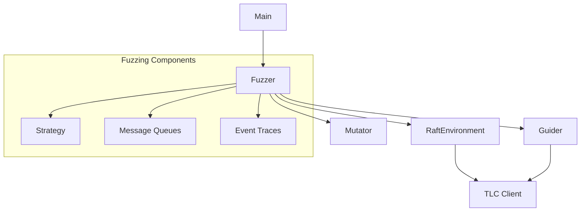
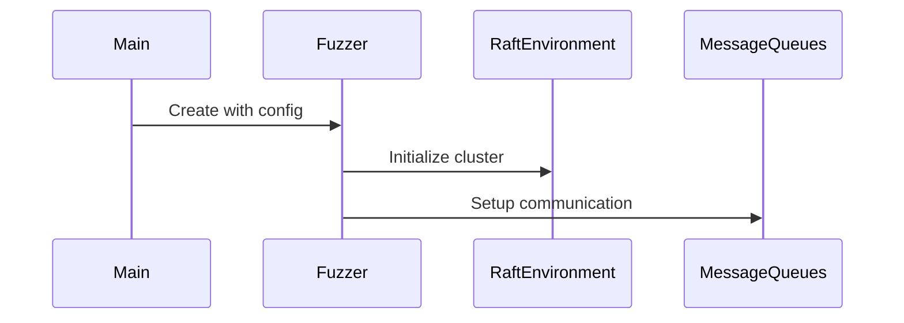
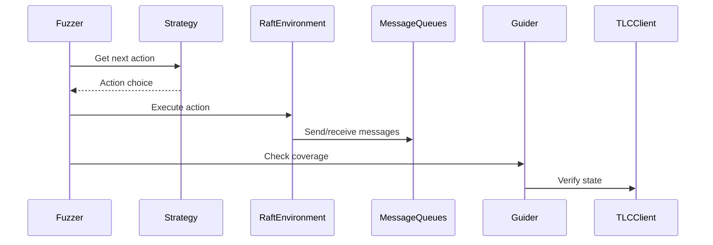
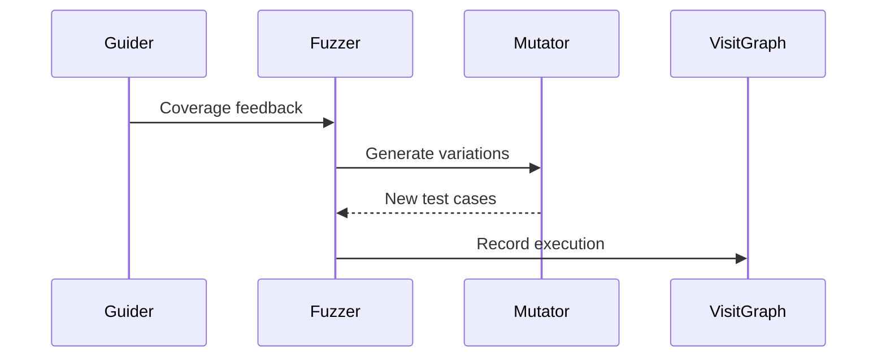

# etcd Fuzzing Architecture

This document describes the architecture and components of the etcd fuzzing system.

## Core Architecture

The system consists of several key components that work together to perform systematic testing of etcd's Raft implementation:

### Key Components

1. **Main Entry Point** (`main.go`)
   - CLI interface with commands:
     - `fuzz`: Run standard fuzzing
     - `compare`: Run comparative benchmarking
   - Configuration of fuzzing parameters

2. **Fuzzer Core** (`fuzzer.go`)
   - Central orchestration of:
     - Trace execution
     - Message scheduling
     - Node crashes/restarts
     - Event generation

3. **Raft Environment** (`raft.go`)
   - Raft cluster simulation:
     - Node lifecycle management
     - Message handling
     - State transitions
     - Log replication

4. **Guidance System** (`guider.go`)
   - Coverage strategies:
     - `TLCStateGuider`: State-based coverage
     - `TraceCoverageGuider`: Execution trace coverage 
     - `LineCoverageGuider`: Code line coverage

5. **Mutation System** (`mutator.go`)
   - Test case mutation strategies:
     - Choice mutation
     - Node skipping
     - Trace swapping
     - Parameter scaling

### Workflow

#### 1. Initialization

#### 2. Test Execution

#### 3. Mutation & Feedback

### Key Features

1. **Configurable Testing**
   - Adjustable fuzzing parameters
   - Multiple testing strategies
   - Different coverage metrics

2. **State Verification**
   - TLC model checking integration
   - Serializability checking
   - Comprehensive state space exploration

3. **Debugging Support**
   - Trace recording capabilities
   - Coverage visualization
   - Performance benchmarking tools

4. **Extensibility**
   - Pluggable component architecture
   - Multiple guidance options
   - Custom mutation strategies

This architecture enables systematic testing of etcd's Raft implementation through:
- Guided fuzzing with state verification
- Coverage-guided feedback
-