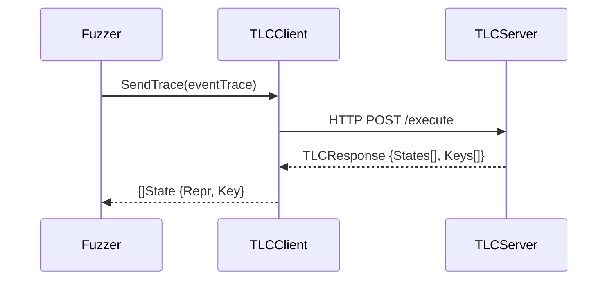

# Event Flow and TLC Integration

This document describes how events are sent to the TLC server, what the server returns, and how these results guide new test case generation.

## 1. Event Sending Process



Key code path:
```go
// tlc_client.go
func (c *TLCClient) SendTrace(trace *List[*Event]) ([]State, error) {
    // 1. Add reset event
    trace.Append(&Event{Reset: true})
    
    // 2. Send HTTP POST request
    data, _ := json.Marshal(trace)
    res, _ := http.Post("http://"+c.ClientAddr+"/execute", "application/json", bytes.NewBuffer(data))
    
    // 3. Parse response
    tlcResponse := &TLCResponse{}
    json.Unmarshal(resData, tlcResponse)
    
    // 4. Convert to States
    result := make([]State, len(tlcResponse.States))
    for i, s := range tlcResponse.States {
        result[i] = State{
            Repr: s,
            Key: tlcResponse.Keys[i]
        }
    }
    return result, nil
}
```

## 2. Guidance Process

The TLC responses are used by different guiders to generate new test cases:

### a. TLCStateGuider
```go
// guider.go
func (t *TLCStateGuider) Check(trace *List[*SchedulingChoice], eventTrace *List[*Event]) (int, float64) {
    // 1. Get states from TLC
    tlcStates, _ := t.tlcClient.SendTrace(eventTrace)
    
    // 2. Track new unique states
    numNewStates := 0
    for _, s := range tlcStates {
        if _, exists := t.statesMap[s.Key]; !exists {
            numNewStates += 1
            t.statesMap[s.Key] = true
        }
    }
    
    // 3. Return guidance metrics
    curStates := len(t.statesMap)
    return numNewStates, float64(numNewStates) / float64(max(curStates, 1))
}
```

### b. TraceCoverageGuider
Extends TLCStateGuider to also track unique event traces:

```go
// guider.go
func (t *TraceCoverageGuider) Check(trace *List[*SchedulingChoice], events *List[*Event]) (int, float64) {
    // 1. Check state coverage
    t.TLCStateGuider.Check(trace, events)
    
    // 2. Track unique event traces
    eTrace := newEventTrace(events)
    key := eTrace.Hash()
    
    new := 0
    if _, exists := t.traces[key]; !exists {
        t.traces[key] = true
        new = 1
    }
    
    return new, float64(new) / float64(len(t.traces))
}
```

## 3. Test Case Generation

The fuzzer uses guidance feedback to generate new test cases:

```go
// fuzzer.go
func (f *Fuzzer) Run() []CoverageStats {
    for i := 0; i < f.config.Iterations; i++ {
        // Execute test
        trace, eventTrace := f.RunIteration(fmt.Sprintf("fuzz_%d", i), mimic)
        
        // Get guidance feedback
        numNewStates, _ := f.config.Guider.Check(trace, eventTrace)
        
        // Generate mutations if found new states
        if numNewStates > 0 {
            numMutations := numNewStates * f.config.MutPerTrace
            for j := 0; j < numMutations; j++ {
                new, ok := f.config.Mutator.Mutate(trace, eventTrace)
                if ok {
                    f.mutatedTracesQueue.Push(copyTrace(new, defaultCopyFilter()))
                }
            }
        }
    }
}
```

## Key Points

1. **Event Collection**:
   - Events are collected during test execution
   - Events include node actions, messages, state changes
   - Events form execution traces

2. **TLC Integration**:
   - TLC server validates traces against specifications
   - Returns reachable states and their unique keys
   - Provides formal verification feedback

3. **Guidance Mechanism**:
   - Uses both state coverage and trace coverage
   - Prioritizes traces that reach new states
   - Guides mutation towards unexplored behaviors

4. **Test Generation**:
   - More mutations generated for traces with new states
   - Different mutation strategies available
   - Maintains queue of promising test cases

This creates a feedback loop where:
- Test execution generates event traces
- TLC validates traces and provides state coverage
- Guidance uses coverage to score traces
- High-scoring traces produce more mutations
- Mutations explore new system behaviors
