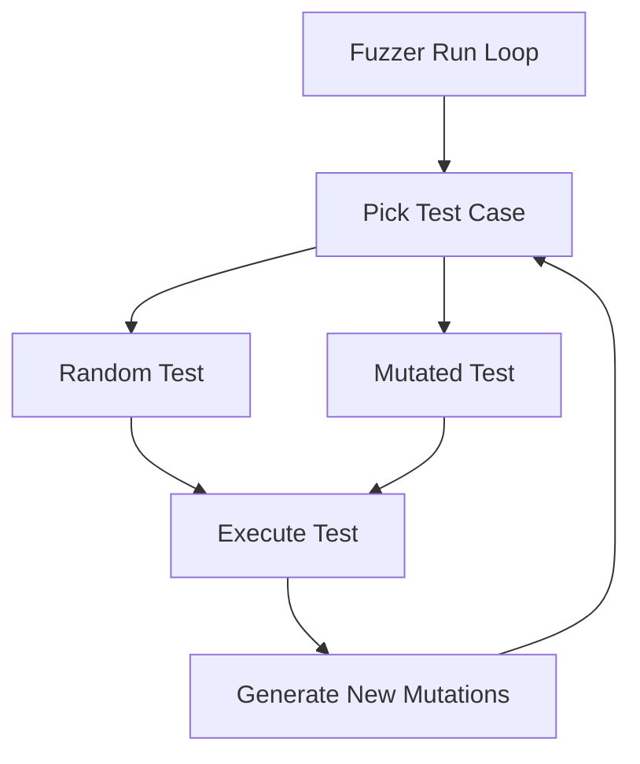

# Test Case Execution Flow

## Overview

The fuzzer applies mutated test cases through a carefully orchestrated process that controls the Raft cluster's behavior. Here's how it works:



## Key Components

1. **Test Selection Process** (from `fuzzer.go`):
```go
// Choose between random or mutated test
var mimic *List[*SchedulingChoice] = nil
if f.mutatedTracesQueue.Size() > 0 {
    f.stats["mutated_executions"] = f.stats["mutated_executions"].(int) + 1
    mimic, _ = f.mutatedTracesQueue.Pop()
} else {
    f.stats["random_executions"] = f.stats["random_executions"].(int) + 1
}
```

2. **Test Case Application**:
- Each test case is a sequence of scheduling choices that control:
  * Message delivery order
  * Node crashes/restarts
  * Client request timing
  * Random decisions in the protocol

## Execution Process

1. **Setup Phase**
```go
// Create trace context for execution
tCtx := &traceCtx{
    trace:          NewList[*SchedulingChoice](),
    eventTrace:     NewList[*Event](),
    nodeChoices:    NewQueue[*SchedulingChoice](),
    booleanChoices: NewQueue[bool](),
    integerChoices: NewQueue[int](),
    crashPoints:    make(map[int]uint64),
    startPoints:    make(map[int]uint64),
    clientRequests: make(map[int]int),
}
```

2. **Loading Mutated Choices**
```go
// If we have a mutated test case (mimic), load its choices
if mimic != nil {
    tCtx.mimicTrace = mimic
    for i := 0; i < mimic.Size(); i++ {
        ch, _ := mimic.Get(i)
        switch ch.Type {
        case Node:              // Message scheduling
        case RandomBoolean:     // Protocol decisions
        case RandomInteger:     // Timing decisions
        case StartNode:         // Node restarts
        case StopNode:         // Node crashes
        case ClientRequest:     // Request timing
        }
    }
}
```

3. **Step-by-Step Execution**
- The fuzzer executes each step in order:
  1. Process node crashes
  2. Handle node restarts
  3. Deliver messages between nodes
  4. Handle client requests
  5. Allow nodes to process and generate responses

```go
for j := 0; j < f.config.Steps; j++ {
    // Apply crash/restart decisions
    if toCrash, ok := tCtx.CanCrash(j); ok {
        f.raftEnvironment.Stop(fCtx, toCrash)
    }
    if toStart, ok := tCtx.CanStart(j); ok {
        f.raftEnvironment.Start(fCtx, toStart)
    }

    // Schedule message delivery
    from, to, maxMessages := tCtx.GetNextNodeChoice()
    messages := f.Schedule(from, to, maxMessages)

    // Handle client requests
    if reqNum, ok := tCtx.IsClientRequest(j); ok {
        f.raftEnvironment.Step(fCtx, req)
    }
}
```

## Test Case Control Flow

1. **Message Control**
- The fuzzer controls message delivery between nodes:
```go
func (f *Fuzzer) Schedule(from uint64, to uint64, maxMessages int) []pb.Message {
    key := fmt.Sprintf("%d_%d", from, to)
    queue := f.messageQueues[key]
    messages := make([]pb.Message, 0)
    
    // Deliver specific number of messages
    for i := 0; i < maxMessages; i++ {
        if message, ok := queue.Pop(); ok {
            messages = append(messages, message)
        }
    }
    return messages
}
```

2. **Event Recording**
- All actions are recorded for analysis:
```go
func recordReceive(message pb.Message, eventTrace *List[*Event]) {
    eventTrace.Append(&Event{
        Name: "DeliverMessage",
        Node: message.To,
        Params: map[string]interface{}{
            "type": message.Type.String(),
            "term": message.Term,
            // ... other fields
        },
    })
}
```

## Feedback Loop

1. **Results Analysis**
```go
// Check for bugs
if f.config.Checker != nil && !f.config.Checker(f.raftEnvironment) {
    f.stats["buggy_executions"] = f.stats["buggy_executions"].(int) + 1
}

// Check for new states
if numNewStates, _ := f.config.Guider.Check(trace, eventTrace); numNewStates > 0 {
    // Generate new mutations
    numMutations := numNewStates * f.config.MutPerTrace
    for j := 0; j < numMutations; j++ {
        new, ok := f.config.Mutator.Mutate(trace, eventTrace)
        if ok {
            f.mutatedTracesQueue.Push(copyTrace(new, defaultCopyFilter()))
        }
    }
}
```

## Practical Example

Consider a test case that explores leader election:

1. **Original Test**:
```
Step 1: Node 1 sends heartbeat
Step 2: Node 2 crashes
Step 3: Election timeout occurs
Step 4: Node 3 starts election
```

2. **Execution**:
- Fuzzer loads these steps
- Controls exact timing of each event
- Records all messages and state changes
- Verifies final cluster state

3. **Results**:
- If new states discovered, generates variations
- If bug found, marks execution as buggy
- Queues successful mutations for further exploration

This controlled execution ensures that the fuzzer can:
- Systematically explore protocol behaviors
- Reproduce specific scenarios
- Find edge cases in timing and ordering
- Verify correctness of the implementation
