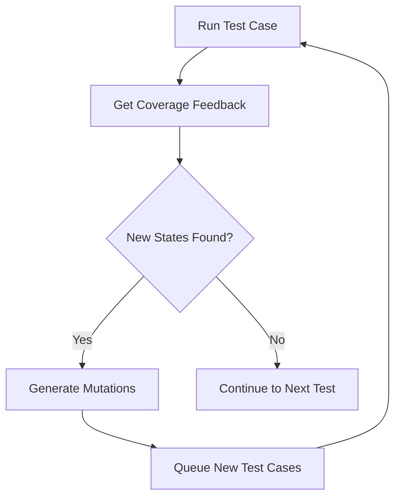

# Test Case Mutation Strategy

This document explains how the fuzzer mutates test cases to explore new system behaviors.

## Mutation Process Overview



## Core Components

### 1. Mutation Trigger
From `fuzzer.go`, mutations are triggered when new states are discovered:

```go
func (f *Fuzzer) Run() []CoverageStats {
    for i := 0; i < f.config.Iterations; i++ {
        // Run the test case
        trace, eventTrace := f.RunIteration(fmt.Sprintf("fuzz_%d", i), mimic)
        
        // Check if new states were found
        if numNewStates, _ := f.config.Guider.Check(trace, eventTrace); numNewStates > 0 {
            // Generate multiple mutations based on new states found
            numMutations := numNewStates * f.config.MutPerTrace
            for j := 0; j < numMutations; j++ {
                new, ok := f.config.Mutator.Mutate(trace, eventTrace)
                if ok {
                    f.mutatedTracesQueue.Push(copyTrace(new, defaultCopyFilter()))
                }
            }
        }
    }
}
```

### 2. Test Case Structure
Test cases consist of several types of scheduling choices:

```go
type SchedulingChoice struct {
    Type          ChoiceType  // Node, RandomBoolean, RandomInteger, StartNode, StopNode, ClientRequest
    From          uint64      // Source node for message
    To            uint64      // Destination node for message
    MaxMessages   int         // Maximum messages to deliver
    Node          uint64      // Node for start/stop operations
    Step          int         // Step at which to perform operation
    BooleanChoice bool        // Random boolean choice
    IntegerChoice int         // Random integer choice
    Request       int         // Client request number
}
```

### 3. Mutation Strategies

The fuzzer supports different mutation strategies:

#### a. Choice Mutator
Flips random decisions in the test case:
- Node selection choices
- Boolean choices
- Integer choices
- Crash/restart points
- Client request timing

Example from the ChoiceMutator:
```go
type ChoiceMutator struct {
    NumFlips int    // Number of choices to flip
    rand     *rand.Rand
}

// Mutates the trace by flipping random choices
func (c *ChoiceMutator) Mutate(trace *List[*SchedulingChoice], events *List[*Event]) (*List[*SchedulingChoice], bool) {
    // Select random points to mutate
    // Flip choices at those points
    // Return new mutated trace
}
```

### 4. Mutation Queue Management

The fuzzer maintains a queue of mutated test cases:

```go
type Fuzzer struct {
    mutatedTracesQueue *Queue[*List[*SchedulingChoice]]  // Queue of pending mutations
    // ...other fields
}
```

Key operations:
1. **Seeding**: Initial population generation
```go
func (f *Fuzzer) seed() {
    f.mutatedTracesQueue.Reset()
    for i := 0; i < f.config.SeedPopulationSize; i++ {
        trace, _ := f.RunIteration(fmt.Sprintf("pop_%d", i), nil)
        f.mutatedTracesQueue.Push(copyTrace(trace, defaultCopyFilter()))
    }
}
```

2. **Execution Selection**: Choose between random or mutated test
```go
var mimic *List[*SchedulingChoice] = nil
if f.mutatedTracesQueue.Size() > 0 {
    f.stats["mutated_executions"] = f.stats["mutated_executions"].(int) + 1
    mimic, _ = f.mutatedTracesQueue.Pop()
} else {
    f.stats["random_executions"] = f.stats["random_executions"].(int) + 1
}
```

## Key Features

1. **Adaptive Mutation Rate**
   - More mutations generated for test cases that find new states
   - Mutation count = numNewStates * MutPerTrace

2. **Diverse Mutation Points**
   - Message scheduling
   - Node crash/restart timing
   - Random choices
   - Client request timing

3. **Population Management**
   - Maintains queue of promising mutations
   - Periodic reseeding for diversity
   - Balance between random and mutated tests

4. **Coverage Guidance**
   - Mutations guided by state coverage
   - Focus on exploring new behaviors
   - Feedback loop with TLC verification

## Example Mutation Flow

1. **Initial Test Case**
   ```
   - Schedule message: Node 1 → Node 2
   - Crash Node 3
   - Client Request 1
   - Restart Node 3
   ```

2. **Possible Mutations**
   ```
   Mutation 1:
   - Schedule message: Node 1 → Node 3  (changed destination)
   - Crash Node 3
   - Client Request 1
   - Restart Node 3

   Mutation 2:
   - Schedule message: Node 1 → Node 2
   - Crash Node 2  (changed crash target)
   - Client Request 1
   - Restart Node 2  (adjusted restart)

   Mutation 3:
   - Schedule message: Node 1 → Node 2
   - Client Request 1  (reordered operations)
   - Crash Node 3
   - Restart Node 3
   ```

This mutation strategy enables systematic exploration of the state space while focusing on behaviors that lead to new states.

## Test Case Execution with Mutations

### 1. Trace Context Setup

When executing a mutated test case, the fuzzer creates a trace context that manages the execution:

```go
type traceCtx struct {
    trace          *List[*SchedulingChoice]    // Current execution trace
    mimicTrace     *List[*SchedulingChoice]    // Mutated trace to follow
    eventTrace     *List[*Event]               // Events generated during execution
    nodeChoices    *Queue[*SchedulingChoice]   // Node scheduling decisions
    booleanChoices *Queue[bool]                // Random boolean choices
    integerChoices *Queue[int]                 // Random integer choices
    crashPoints    map[int]uint64              // When to crash nodes
    startPoints    map[int]uint64              // When to restart nodes
    clientRequests map[int]int                 // Client request scheduling
}
```

### 2. Execution Process

The fuzzer executes mutated traces through these steps:

1. **Initialization**
   ```go
   // Set up trace context with mutated choices
   if mimic != nil {
       tCtx.mimicTrace = mimic
       for i := 0; i < mimic.Size(); i++ {
           ch, _ := mimic.Get(i)
           switch ch.Type {
           case Node:              // Message scheduling choices
           case RandomBoolean:     // Boolean decisions
           case RandomInteger:     // Integer decisions
           case StartNode:         // Node restart points
           case StopNode:          // Node crash points
           case ClientRequest:     // Client request timing
           }
       }
   }
   ```

2. **Step-by-Step Execution**
   ```go
   for j := 0; j < f.config.Steps; j++ {
       // Handle node crashes
       if toCrash, ok := tCtx.CanCrash(j); ok {
           f.raftEnvironment.Stop(fCtx, toCrash)
       }
       
       // Handle node restarts
       if toStart, ok := tCtx.CanStart(j); ok {
           f.raftEnvironment.Start(fCtx, toStart)
       }
       
       // Schedule messages between nodes
       from, to, maxMessages := tCtx.GetNextNodeChoice()
       messages := f.Schedule(from, to, maxMessages)
       
       // Handle client requests
       if reqNum, ok := tCtx.IsClientRequest(j); ok {
           f.raftEnvironment.Step(fCtx, req)
       }
   }
   ```

### 3. Message Handling

Messages are scheduled between nodes based on the mutated trace:

```go
func (f *Fuzzer) Schedule(from uint64, to uint64, maxMessages int) []pb.Message {
    key := fmt.Sprintf("%d_%d", from, to)
    queue := f.messageQueues[key]
    messages := make([]pb.Message, 0)
    
    // Deliver up to maxMessages messages between nodes
    for i := 0; i < maxMessages; i++ {
        if message, ok := queue.Pop(); ok {
            messages = append(messages, message)
        }
    }
    return messages
}
```

### 4. Event Recording

All events during execution are recorded for analysis:

```go
func recordReceive(message pb.Message, eventTrace *List[*Event]) {
    eventTrace.Append(&Event{
        Name: "DeliverMessage",
        Node: message.To,
        Params: map[string]interface{}{
            "type":     message.Type.String(),
            "term":     message.Term,
            "from":     message.From,
            "to":       message.To,
            // ... other message fields
        },
    })
}
```

### 5. Verification

After execution, the test case is verified:

1. **State Check**: Verify if the Raft cluster reached a valid state
2. **Coverage Analysis**: Check if new states were discovered
3. **Bug Detection**: Run configured checkers (e.g., SerializabilityChecker)

```go
if f.config.Checker != nil && !f.config.Checker(f.raftEnvironment) {
    f.stats["buggy_executions"] = f.stats["buggy_executions"].(int) + 1
}
```

### 6. Test Case Evolution

Successful test cases (those finding new states) generate more mutations:

```go
if numNewStates, _ := f.config.Guider.Check(trace, eventTrace); numNewStates > 0 {
    numMutations := numNewStates * f.config.MutPerTrace
    for j := 0; j < numMutations; j++ {
        new, ok := f.config.Mutator.Mutate(trace, eventTrace)
        if ok {
            f.mutatedTracesQueue.Push(copyTrace(new, defaultCopyFilter()))
        }
    }
}
```

This creates a feedback loop where:
1. Mutated test cases are executed
2. Successful tests spawn new mutations
3. New mutations explore different scheduling scenarios
4. Coverage gradually increases through evolution

The mutation-based testing approach helps explore:
- Different message orderings
- Various node crash/restart timings
- Alternative client request schedules
- Edge cases in consensus protocol
- Potential race conditions
